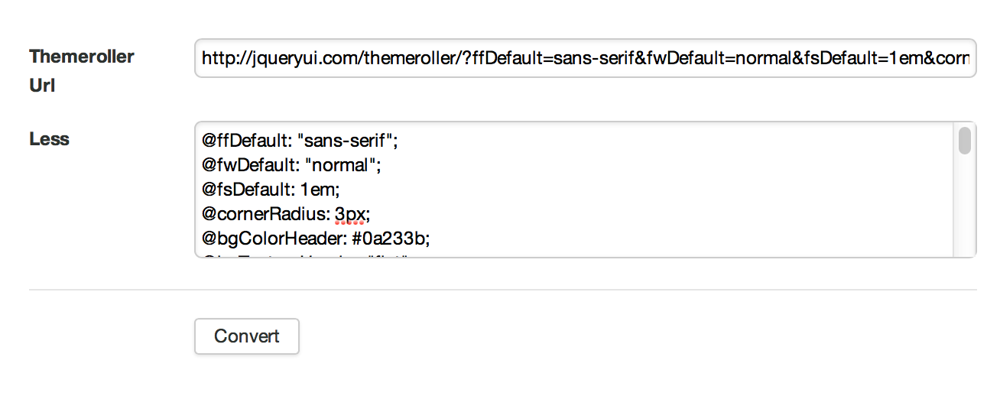

# Themeroller Config Extractor

This addon helps you convert jQuery UI Themeroller settings into a LESS
compatible include file.

We hope that Themeroller will start using LESS in the future, but for
now it simply generates a CSS file. When we want to add additional
styles in CSS, we often need to rely on same colors as defined in
themeroller. Currently we must manually find and copy-paste colors. 

By using this simple convertor, it's possible to easily convert URL into
LESS include file and then re-use in your custom LESS framework.

## How to use in Agile Toolkit

1. Follow instructions on [packagist.org/packages/romaninsh/themeroller_extractor](https://packagist.org/packages/romaninsh/themeroller_extractor).
2. Route page to add-on by adding into your Application class (`Frontend.php`)

        $this->routePages('themeroller','romaninsh/themeroller_extractor');
3. Open page `themeroller` on your site.

## See also

For an example of a current Agile Toolkit jQuery UI theme settings, see [https://github.com/atk4/atk4/blob/master/templates/shared/css/less/jui-variables.less](https://github.com/atk4/atk4/blob/master/templates/shared/css/less/jui-variables.less)

## Copyright

This add-on is distributed under AGPL and MIT licenses, use it for free without limitations.
